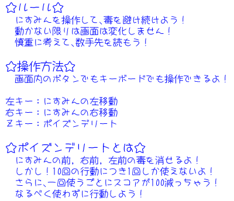

# NisGame01-wiselyavoider

# にすみんの大冒険 -wisely avoider-

にすみんの大冒険 -wisely avoider- は、[にすみん（@Nispectre）](https://twitter.com/Nispectre)によって開発されたゲームです。

## ゲームの概要
[ゲームの概要や目的についての説明をここに追加してください。]

## ゲームのルール

[ゲームのルールやプレイ方法についての詳細な説明をここに追加してください。]

## キャラクター

[キャラクターの詳細や特徴についての説明をここに追加してください。]

## 使用技術
- HTML
- CSS
- JavaScript

## 制作情報
- 作者：にすみん（@Nispectre）
- Illustration：爽（@frais_glace）
- BGM：「Wings of my dream」/ Nismin
- SE：効果音ラボ（[効果音ラボ](https://soundeffect-lab.info/)）
- VOICEVOX（[VOICEVOX](https://voicevox.hiroshiba.jp/)）

## 更新情報
- バージョン：1.0.31 for Online
- iPhone使用時の挙動の悪さを改善
- iPhone使用時のダブルタップによる拡大を阻止

## 連絡先
Twitter: [にすみん（@Nispectre）](https://twitter.com/Nispectre)

## ライセンス
[ゲームのライセンス情報をここに追加してください。]
